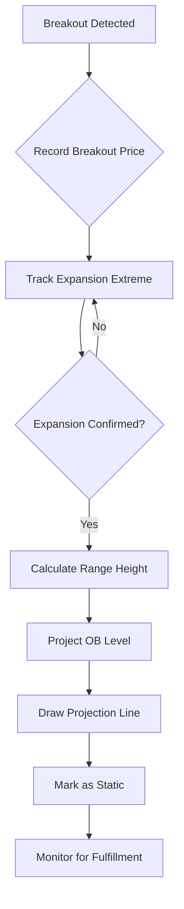

# OB Projection Implementation Plan for Master Pattern Script

## Executive Summary

This document outlines the detailed implementation plan for adding **Order Block (OB) Projections** to the existing [`master-pattern-luxalgo.pine`](master-pattern-luxalgo.pine) script, following the **Trade ATS "Master Pattern – Advanced Theory"** methodology.

---

## Requirements Specification

### Core Requirements (From User Clarification)

1. **Expansion Range Measurement**: From breakout point to extreme of confirmed expansion (actual price movement)
2. **Projection Timing**: After expansion confirmation (not immediate breakout)
3. **Multiple Projections**: Keep historical projections visible
4. **Projection Updates**: Static once drawn (no dynamic updates)

### OB Projection Formula

```
For Bullish Breakout:
  Upper OB Projection = Expansion High + (1 × Expansion Range Height)
  
For Bearish Breakout:
  Lower OB Projection = Expansion Low - (1 × Expansion Range Height)

Where:
  Expansion Range Height = |Expansion Extreme - Breakout Point|
```

---

## Current Script Analysis

### Existing Structure (Lines 1-156)

The script already provides:

1. **Contraction Detection** (Lines 39-68)
   - Uses pivot highs/lows to identify contraction zones
   - Variables: `top`, `btm`, `phy`, `ply`, `pht`, `plt`
   - Triggers when lower highs and higher lows converge

2. **Breakout Detection** (Lines 74-93)
   - `isbull`: Detects bullish breakout when `high[length] > top`
   - `isbear`: Detects bearish breakout when `low[length] < btm`
   - Creates master pattern object with box and average line

3. **Pattern Tracking** (Lines 95-119)
   - Tracks if pattern becomes "major" (retest validation)
   - Uses `master.breakup` and `master.breakdn` flags

4. **User-Defined Type (UDT)** (Lines 32-36)
   ```pine
   type mp
       box area
       line avg
       bool breakup
       bool breakdn
   ```

### Integration Points Identified

| Location | Purpose | Integration Strategy |
|----------|---------|---------------------|
| **Lines 8-28** | Settings section | Add OB projection input settings |
| **Lines 32-36** | UDT definition | Extend `mp` type with OB projection fields |
| **Lines 78-93** | Breakout detection | Initialize OB projection tracking |
| **After Line 119** | New section | Add OB projection calculation and drawing logic |

---

## Implementation Design

### 1. Data Structure Additions

#### A. Extend the `mp` User-Defined Type

```pine
type mp
    box area
    line avg
    bool breakup
    bool breakdn
    // NEW: OB Projection fields
    float breakout_price        // Price at breakout confirmation
    float expansion_extreme     // Highest high (bull) or lowest low (bear)
    float expansion_range       // Calculated range height
    line ob_projection          // The projection line
    label ob_label              // Optional label for projection
    bool projection_confirmed   // Flag to prevent recalculation
    bool projection_reached     // Track if price reached projection
```

#### B. Add Global Variables for Tracking

```pine
// After line 46 (existing var declarations)
var float breakout_ref = na      // Reference price when breakout occurs
var float expansion_tracking = na // Track the extreme during expansion
var bool expansion_confirmed = false
var int expansion_start_bar = na
```

---

### 2. User Input Settings

Add to the Settings section (after line 27):

```pine
//OB Projection Settings
showOBProj = input(true, 'Show OB Projections', group = 'OB Projections')
obProjStyle = input.string('Dashed', 'Projection Line Style', 
    options = ['Solid', 'Dashed', 'Dotted'], group = 'OB Projections')
showOBLabels = input(true, 'Show Projection Labels', group = 'OB Projections')
obBullProjCss = input.color(color.new(color.teal, 30), 'Bullish Projection', group = 'OB Projections')
obBearProjCss = input.color(color.new(color.red, 30), 'Bearish Projection', group = 'OB Projections')
expansionConfirmBars = input.int(3, 'Expansion Confirmation Bars', 
    minval = 1, maxval = 10, group = 'OB Projections',
    tooltip = 'Number of bars to wait before confirming expansion')
```

---

### 3. OB Projection Calculation Logic

#### Workflow Diagram



#### Implementation Steps

**Step 1: Initialize on Breakout** (Modify lines 78-93)

```pine
if isbull or isbear
    css = isbull ? bullCss : bearCss
    
    master.avg.set_x2(n-length)
    val = math.avg(top, btm)
    
    // NEW: Initialize OB projection tracking
    breakout_ref := isbull ? top : btm  // Record breakout level
    expansion_tracking := isbull ? high : low  // Start tracking extreme
    expansion_confirmed := false
    expansion_start_bar := n
    
    // Create new master pattern object (existing code)
    master := mp.new(
      (isbull and showBullBox) or (isbear and showBearBox) ? 
        box.new(math.max(phx, plx), top, n-length, btm, na, 
        bgcolor = showMinor ? color.new(css, 50) : na) : na
      , (isbull and showBullLvl) or (isbear and showBearLvl) ? 
        line.new(n-length, val, n, val, color = showMinor ? css : na) : na
      , isbull
      , isbear
      // NEW: Initialize OB fields
      , breakout_ref
      , na  // expansion_extreme (to be calculated)
      , na  // expansion_range
      , na  // ob_projection line
      , na  // ob_label
      , false  // projection_confirmed
      , false) // projection_reached
    
    top := na
    btm := na
```

**Step 2: Track Expansion Extreme** (New section after line 119)

```pine
//-----------------------------------------------------------------------------}
//OB Projection Tracking
//-----------------------------------------------------------------------------{

// Track expansion extreme during active breakout
if not na(master.breakout_price) and not master.projection_confirmed
    if master.breakup
        // For bullish: track highest high
        expansion_tracking := math.max(expansion_tracking, high)
        
        // Confirm expansion after N bars
        if n - expansion_start_bar >= expansionConfirmBars
            expansion_confirmed := true
            
    else if master.breakdn
        // For bearish: track lowest low
        expansion_tracking := math.min(expansion_tracking, low)
        
        // Confirm expansion after N bars
        if n - expansion_start_bar >= expansionConfirmBars
            expansion_confirmed := true
```

**Step 3: Calculate and Draw OB Projection** (Continue new section)

```pine
// Calculate OB projection once expansion is confirmed
if expansion_confirmed and not master.projection_confirmed and showOBProj
    
    // Store expansion extreme
    master.expansion_extreme := expansion_tracking
    
    // Calculate expansion range height
    master.expansion_range := master.breakup ? 
        (master.expansion_extreme - master.breakout_price) :
        (master.breakout_price - master.expansion_extreme)
    
    // Calculate OB projection level
    ob_level = master.breakup ?
        master.expansion_extreme + master.expansion_range :
        master.expansion_extreme - master.expansion_range
    
    // Determine line style
    line_style = obProjStyle == 'Solid' ? line.style_solid :
                 obProjStyle == 'Dashed' ? line.style_dashed :
                 line.style_dotted
    
    // Draw projection line
    proj_color = master.breakup ? obBullProjCss : obBearProjCss
    master.ob_projection := line.new(
        n, ob_level, n + 50, ob_level,
        color = proj_color,
        style = line_style,
        width = 2)
    
    // Add label if enabled
    if showOBLabels
        label_text = master.breakup ? 
            "OB↑ " + str.tostring(ob_level, format.mintick) :
            "OB↓ " + str.tostring(ob_level, format.mintick)
        
        master.ob_label := label.new(
            n, ob_level,
            text = label_text,
            style = master.breakup ? label.style_label_up : label.style_label_down,
            color = proj_color,
            textcolor = color.white,
            size = size.small)
    
    // Mark as confirmed (static from now on)
    master.projection_confirmed := true
    
    // Reset tracking variables
    expansion_confirmed := false
    breakout_ref := na
    expansion_tracking := na
```

**Step 4: Monitor Projection Fulfillment** (Continue new section)

```pine
// Track if projection is reached
if not na(master.ob_projection) and not master.projection_reached
    proj_level = master.ob_projection.get_y1()
    
    if master.breakup and high >= proj_level
        master.projection_reached := true
        // Optional: Change line style to indicate fulfillment
        master.ob_projection.set_style(line.style_solid)
        master.ob_projection.set_width(3)
        
    else if master.breakdn and low <= proj_level
        master.projection_reached := true
        // Optional: Change line style to indicate fulfillment
        master.ob_projection.set_style(line.style_solid)
        master.ob_projection.set_width(3)

// Extend projection line to current bar if not reached
if not na(master.ob_projection) and not master.projection_reached
    master.ob_projection.set_x2(n)

//-----------------------------------------------------------------------------}
```

---

### 4. Visual Design Specifications

#### Line Styles

| Element | Style | Color | Width |
|---------|-------|-------|-------|
| **Bullish OB Projection** | Dashed (default) | Teal (30% transparent) | 2px (3px when reached) |
| **Bearish OB Projection** | Dashed (default) | Red (30% transparent) | 2px (3px when reached) |
| **Projection Label** | Label up/down | Matching projection color | Small |

#### Label Format

```
Bullish: "OB↑ 1.2345"
Bearish: "OB↓ 1.2345"
```

---

### 5. Edge Cases and Validation

#### Scenarios to Handle

1. **Multiple Breakouts Before Confirmation**
   - Solution: Only track the most recent breakout; reset on new pattern

2. **Price Reverses Before Confirmation**
   - Solution: Cancel projection if price breaks back into contraction zone

3. **Extreme Volatility**
   - Solution: Use `expansionConfirmBars` to filter noise

4. **Historical Projections Overlap**
   - Solution: Keep all visible (per requirements); users can disable if cluttered

#### Validation Logic

```pine
// Add to expansion tracking section
// Cancel projection if price reverses back into contraction
if not master.projection_confirmed
    if master.breakup and low < master.breakout_price
        // Reset tracking
        expansion_confirmed := false
        breakout_ref := na
        expansion_tracking := na
        
    else if master.breakdn and high > master.breakout_price
        // Reset tracking
        expansion_confirmed := false
        breakout_ref := na
        expansion_tracking := na
```

---

## Implementation Checklist

### Phase 1: Core Structure
- [ ] Extend `mp` UDT with OB projection fields
- [ ] Add global tracking variables
- [ ] Add user input settings

### Phase 2: Logic Implementation
- [ ] Initialize OB tracking on breakout detection
- [ ] Implement expansion extreme tracking
- [ ] Add expansion confirmation logic
- [ ] Calculate OB projection levels

### Phase 3: Visualization
- [ ] Draw projection lines with proper styling
- [ ] Add projection labels
- [ ] Implement line extension to current bar
- [ ] Add fulfillment detection and visual feedback

### Phase 4: Edge Cases
- [ ] Handle reversal before confirmation
- [ ] Manage multiple breakouts
- [ ] Test with various timeframes
- [ ] Validate historical projection display

### Phase 5: Testing
- [ ] Test on bullish breakouts
- [ ] Test on bearish breakouts
- [ ] Test projection accuracy
- [ ] Test visual rendering
- [ ] Test with different input settings

---

## Code Insertion Map

| Section | Line Range | Action |
|---------|-----------|--------|
| **Settings** | After line 27 | Insert OB projection inputs |
| **UDT** | Lines 32-36 | Extend `mp` type definition |
| **Variables** | After line 46 | Add tracking variables |
| **Breakout Init** | Lines 78-93 | Modify to initialize OB tracking |
| **New Section** | After line 119 | Add complete OB projection logic |

---

## Expected Behavior

### On Bullish Breakout
1. Price breaks above contraction `top`
2. System records breakout price
3. Tracks highest high for N bars (default: 3)
4. Calculates expansion range = (highest high - breakout price)
5. Projects OB level = highest high + expansion range
6. Draws teal dashed line at OB level
7. Extends line until price reaches it
8. Changes to solid line when fulfilled

### On Bearish Breakout
1. Price breaks below contraction `btm`
2. System records breakout price
3. Tracks lowest low for N bars (default: 3)
4. Calculates expansion range = (breakout price - lowest low)
5. Projects OB level = lowest low - expansion range
6. Draws red dashed line at OB level
7. Extends line until price reaches it
8. Changes to solid line when fulfilled

---

## Performance Considerations

- **Max Lines**: Script already set to `max_lines_count = 500`
- **Historical Projections**: Each pattern creates 1 line + 1 label (if enabled)
- **Memory**: UDT fields add minimal overhead
- **Calculation**: O(1) per bar after confirmation

---

## Future Enhancements (Optional)

1. **Multi-Standard Deviation Projections**
   - Add 1.5x, 2x projection levels
   
2. **Projection Statistics**
   - Track fulfillment rate
   - Display success percentage

3. **Alert System**
   - Alert when projection is reached
   - Alert when expansion is confirmed

4. **Projection Zones**
   - Draw boxes instead of lines
   - Show probability zones

---

## Summary

This implementation plan provides a complete, methodologically-aligned approach to adding OB projections to the Master Pattern script. The design:

✅ Follows Trade ATS methodology exactly  
✅ Integrates seamlessly with existing code  
✅ Maintains code organization and readability  
✅ Handles edge cases and validation  
✅ Provides clear visual feedback  
✅ Keeps historical context visible  

The implementation is ready for code mode execution.